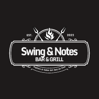

<!--
!!! IMPORTANT !!!
This README is an example of how you could professionally present your codebase. 
Writing documentation is a crucial part of your work as a professional software developer and cannot be ignored. 

You should modify this file to match your project and remove sections that don't apply.

REQUIRED SECTIONS:
- Table of Contents
- About the Project
  - Built With
  - Live Demo
- Getting Started
- Authors
- Future Features
- Contributing
- Show your support
- Acknowledgements
- License

OPTIONAL SECTIONS:
- FAQ

After you're finished please remove all the comments and instructions!

For more information on the importance of a professional README for your repositories: https://github.com/microverseinc/curriculum-transversal-skills/blob/main/documentation/articles/readme_best_practices.md
-->

  <!-- You are encouraged to replace this logo with your own! Otherwise you can also remove it. -->
  
   

  <h3><b>Swing & Notes Restaurante de Jazz en Vivo</b></h3>

<!-- TABLE OF CONTENTS -->

# 📗 Table of Contents

- [📖 About the Project](#about-project)
  - [🛠 Built With](#built-with)
    - [Tech Stack](#tech-stack)
    - [Key Features](#key-features)
  - [🚀 Live Demo](#live-demo)
- [💻 Getting Started](#getting-started)
  - [Prerequisites](#prerequisites)
  - [Setup](#setup)
  - [Install](#install)
  - [Usage](#usage)
  - [Run tests](#run-tests)
  - [Deployment](#deployment)
- [👥 Authors](#authors)
- [🔭 Future Features](#future-features)
- [🤝 Contributing](#contributing)
- [⭐️ Show your support](#support)
- [🙏 Acknowledgements](#acknowledgements)
- [📝 License](#license)

<!-- PROJECT DESCRIPTION -->

# 📖 [Swing & Notes Restaurante de Jazz en Vivo] 

**[Swing & Notes Restaurante de Jazz en Vivo]** is the web page of Swing & Notes, a restaurant in Bogotá with jazz live music. This is a capstone project that required me to distribute the layout with HTML, style it, and make it responsive for mobile and desktop with CSS.

## 🛠 Built With 

### Tech Stack 

  
Client

  <ul>
    <li><a href="https://reactjs.org/">HTML</a></li>
    <li><a href="https://reactjs.org/">CSS</a></li>
    <li><a href="https://reactjs.org/">JavaScript</a></li>
    <li><a href="https://reactjs.org/">Nodejs</a></li>
  </ul>

  
Server

  <ul>
    <li><a href="https://www.github.com">Express.js</a></li>
  </ul>

### Key Features 

- **[Responsive design for mobile and desktop]**
- **[Functionality using JavaScript]**
- **[Use of transitions and animations with CSS]**

(<a href="#readme-top">back to top</a>)

<!-- LIVE DEMO -->

## 🚀 Live Demo 

- [Live Demo Link](https://danielf-canon.github.io/Capstone-project/index.html)

(<a href="#readme-top">back to top</a>)

<!-- GETTING STARTED -->

## 💻 Getting Started 

To get a local copy up and running, follow these steps.

### Prerequisites

In order to run this project you need:

Code Editor
Nodejs
Github

### Setup

Clone this repository to your desired folder:

https://github.com/danielf-canon/Capstone-project.git

### Install

No need To install any dependency

### Usage

Run the server from the live-server extinction

### Run tests

To run tests, use the developer tools.

### Deployment

You can deploy this project using github.

(<a href="#readme-top">back to top</a>)

<!-- AUTHORS -->

## 👥 Authors 

👤 Daniel Felipe Cañón

- Twitter: [Twitter](https://twitter.com/canonsanchezd)
- GitHub: [@githubhandle](https://github.com/danielf-canon)
- LinkedIn: [LinkedIn](https://linkedin.com/in/daniel-felipe-canon-sanchez)

(<a href="#readme-top">back to top</a>)

<!-- FUTURE FEATURES -->

## 🔭 Future Features 

-  **Product popup**
-  **Events popup**

(<a href="#readme-top">back to top</a>)

<!-- CONTRIBUTING -->

## 🤝 Contributing 

Contributions, issues, and feature requests are welcome!

Feel free to check the [issues page](https://github.com/danielf-canon/Capstone-project/issues).

(<a href="#readme-top">back to top</a>)

## ⭐️ Show your support 

If you like this project remember to share it.

(<a href="#readme-top">back to top</a>)

## 🙏 Acknowledgments 

I would like to thank every persone that encourge me to start this journey

(<a href="#readme-top">back to top</a>)

<!-- LICENSE -->

## 📝 License 

This project is [MIT](MIT.md) licensed.

(<a href="#readme-top">back to top</a>)

